# Statistical Analysis of Vintage Data

## Hilary J. Sturges

## Western Governors University


Abstract 
=========

This study aimed to prove that there is a bias when it comes to wine reviews,
specifically pertaining to country of origin, price and variety of the wine. The
study focused on each independent variable individually as well as building a
multiple linear regression model to predict the dependent variable, points.
Parametric and non-parametric methods were used including ANOVA and post hoc
tests.

The individual study concluded that each variable was a viable candidate for
prediction. The model accounted for 25% of the variation in the results. While
not a great score, it performs better than a baseline model. After comparing the
predicted points with the actual points in the validation dataset, it can be
concluded that the model performed poorly.

There appears to be no inherent bias when it comes to price, country of origin
and variety of wine in wine reviews.

Statistical Analysis of Vintage Data 
=====================================

The purpose of this research project is to analyze wine reviews for bias. Three
independent variables will be studied and used to predict one dependent
variable.

The first independent variable is price. This study will attempt to demonstrate
that there is a bias in wine reviews when it comes to price. It has been proven
that price has a significant impact on consumer reviews (Li, 2010) and this
study will attempt to apply this impact to wine reviews. Price is a continuous
variable, ranging from \$4 to \$3,300. There are no outliers in the dataset for
price.

The second independent variable is country (of origin). This study will attempt
to demonstrate that there is a bias in wine reviews when it comes to country of
origin. Origin has been shown to have a significant impact on wine flavor (as
indicated by TPC) (Hosu, 2016).

Country is a categorical variable with 51 unique values.

The third independent variable is variety, specifically the type of wine.
Examples include Chardonnay, Chablis, Merlot, etc. This study will attempt to
demonstrate that there is a bias in wine reviews when it comes to country of
variety. Variety is a categorical variable with 756 unique values.

This study will focus on the overall impact of these factors and attempt
predictive analysis. It will also include individual study of each factor. Both
parametric and nonparametric methods will be used.

The dependent variable is points. Points are used to indicate a wine reviewer’s
opinion of a wine. Points is a continuous variable, ranging from 80 to 100.

The data will be split (60/40) into training and validation datasets. Parametric
and nonparametric methods will be used in this study. Box plots and scatter
plots will be used to explore the relationship between the dependent variable
and the independent variables. Tests for the assumptions of ANOVA will be
performed, including Levene’s test of homogeneity. Post-hoc tests will be
implemented to determine the significant variables. Linear regression will be
used to create a predictive model that will be scored using the validation data.
SAS will be used to analyze the data as well as to create any accompanying
charts.

Research Question 
==================

Do the variables price, country, and variety accurately predict the variable points?

>   H<sub>0</sub> The independent variables do not accurately predict the dependent variable.

>   H<sub>A</sub> The independent variables accurately predict the dependent variable.

A multiple linear regression model will be built to assess this question.

Data Collection 
================

This dataset was taken from Kaggle. It was originally collected from Wine
Enthusiast (winemag.com) in 2017. Wine Enthusiast is a popular magazine that has
been in print for over 30 years, making it a trustworthy source of reviews (Flowers, 2015).
Retrieved from *https://www.kaggle.com/zynicide/wine-reviews*

The data consists of two .csv files, winemag-data-130k-v2 and
winemag-data_first150k.

They will be combined into one large dataset and then split into training and
validation sets.

The following variables will be deleted due to missing values; title,
taster_name and taster_twitter_handle. This will not affect analysis. The
variables country and variety have few missing values, so any observations that
are missing those variables will be deleted in the building of the model. There
are several thousand records missing the value for price, for this median
imputation will be used. This dataset contains over 280,000 observations, making
it more than adequate for thorough analysis. (Thoutt, 2017).

Data Extraction and Preparation 
================================

To begin, a library was created in SAS Studio:

```SAS
libname winedata '/folders/myfolders/wine-data';
```

The first csv file was imported using the following code:
```SAS

  %web_drop_table(WORK.IMPORT);

   filename one30 "/folders/myfolders/winemag-data-130kv2.csv";

   proc import datafile=one30 dbms=csv out=import;
   getnames=yes;
   guessingrows=100;
   run;

   proc contents data=import;
   run;

   %web_open_table(WORK.IMPORT);

```

The second csv file was imported using the following code:

```SAS
   %web_drop_table(WORK.IMPORT1);

   filename one50 "/folders/myfolders/winemagdata_first150k.csv";

   proc import datafile=one50 dbms=csv out=import1;
   getnames=yes;
   guessingrows=100;
   run;
   
   proc contents data=import1;
   run;

   %web_open_table(WORK.IMPORT1);
```

A master dataset containing both csv files (dropping unneeded variables) was
created with the following code:

```SAS
   data winedata.master(drop= taster_name taster_twitter_handle title var1)
   replace;
   length country $9;
   set import1 import;
   run;
```

\*Country was set to a length of 9, the shorter of the two in the datasets in
order to prevent duplicated entries

Proc contents was used to view information about the newly created dataset:

```SAS
   proc contents data=winedata.master;
   run;
```

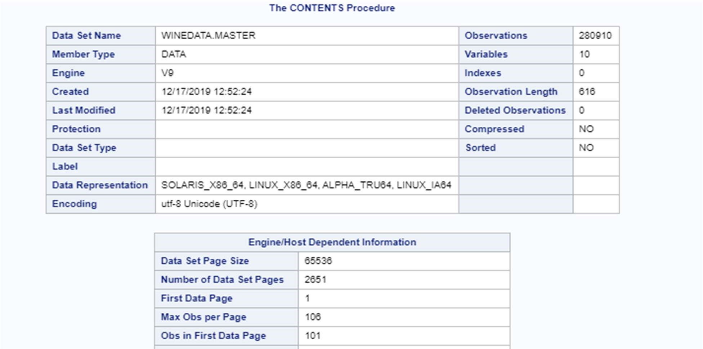

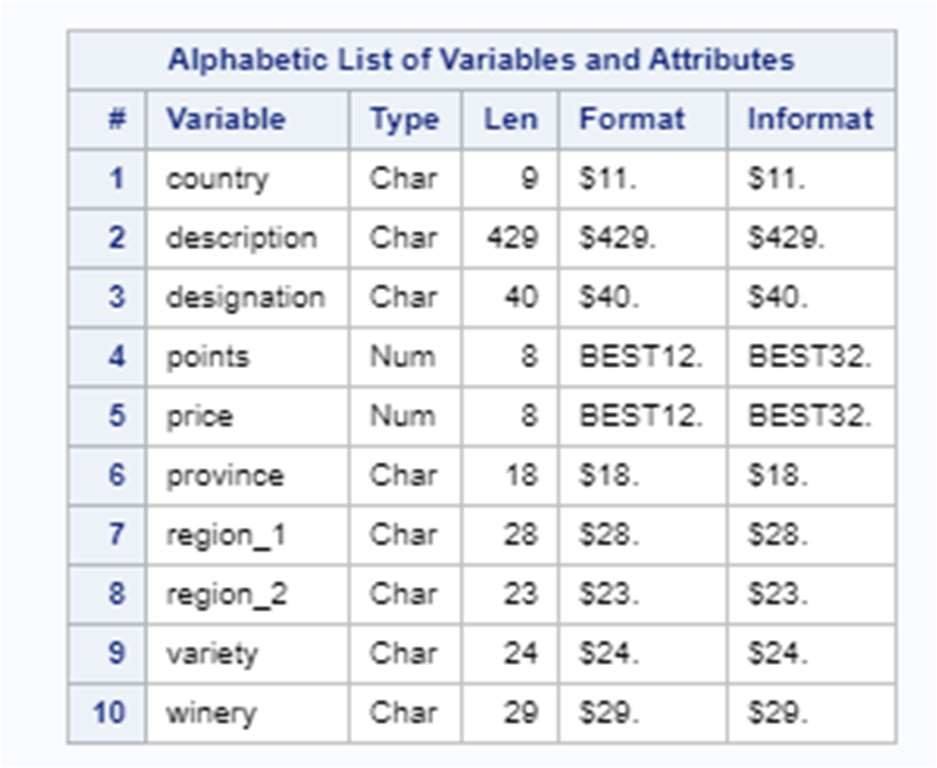

The independent variables, country, price, and variety can be seen in the table
above with lengths 9, 8 and 24 respectively. Country and variety are
character/categorical variables while price is numeric/continuous.


The proc means procedure was used to gather further information about the dataset:

```SAS
   proc means data=winedata.master nmiss;
   run;
```

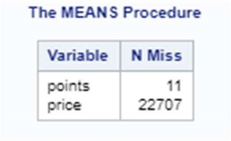

As can be seen in the above table, points is missing in 11 of the observations,
those were dropped. Price is missing in 22,707 of the observations, those were
remedied with median imputation.

Median imputation was performed with the following code:

```SAS
   proc stdize data=winedata.master reponly method=median
   out=winedata.master_imp;
   var price;
   run;
```

A new dataset was created, master_imp. This dataset was then further cleaned:

```SAS
   data winedata.data_clean;
   set winedata.master_imp;
   where points is not missing and points >= 80;
   run;
```

Only observations with a value of 80 and above will be considered for
observation and saved to the new dataset, data_clean. Wine Enthusiast states
that it only publishes reviews at 80 points or above but several observations
contained a value for points below 80, these are assumed to be incorrect values
(Wine Enthusiast, 2019). Any missing values for points will also be dropped
during this step.

The data was then split into training and test datasets, the first step being to
sort by the dependent variable points:

```SAS
   proc sort data=winedata.data_clean out=wine_sort;
   by points;
   run;
```

A new data set was created wine_sort which was then split into training (60%)
and validation (40%) datasets:

```SAS
   proc surveyselect data=wine_sort
   method=srs samprate= .60 out=wine_select seed= 2222 outall;
   strata points;
   run;
   
   data winedata.train;
   set wine_select;
   if selected= 1;
   drop selected SamplingWeight SelectionProb;
   run;

   data winedata.validate;
   set wine_select;
   if selected= 0;
   drop selected SamplingWeight SelectionProb;
   run;
```

The seed “2222” was used, so that if necessary the step can be repeated with the
same results. Once the data was split, a new variable selected was created. If
the value for selected was 1, it went into the training dataset train. If the
value for selected was 0, it went into the validation dataset validate. During
this process, SamplingWeight and SelectionProb were created and subsequently
dropped.

Analysis 
=========

SAS will be used (rather than R or Python) due to its extensive capability to
analyze large datasets (Tuffery, 2011). It has built-in functionality for
methods such as ANOVA and KruskalWallis as well as generating predictive models.
SAS is free for students so there will be no costs associated with this project.
SAS Studio runs on a virtual machine from the browser, enabling faster
processing of data. SAS is known world-wide as an important business analytics
tool. IDC ranks SAS a leader in 2018 revenue for artificial intelligence
software, growing more than 3x faster than the overall market (SAS, 2019).

The box plot of country vs points was created with the following code:

```SAS
   proc sgplot data=winedata.train;
   vbox points / category=country connect=mean;
   run;
```

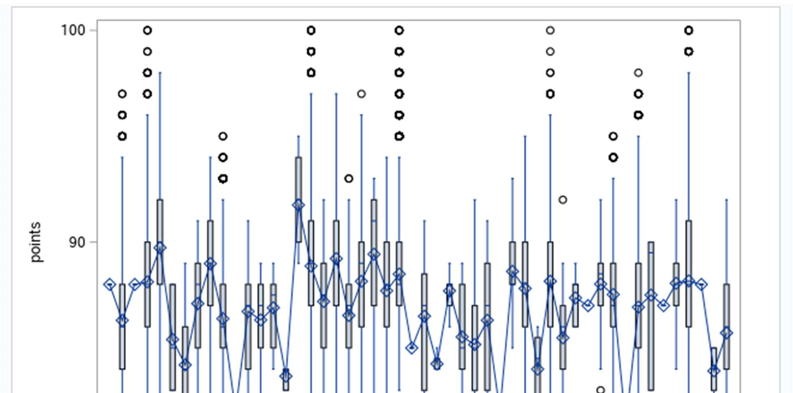

The box plot of variety vs points proved to have too many unique observations, it was unintelligible and unfit to analyze.

The scatterplot of price vs points was created with the following code:

```SAS
   proc sgscatter data=winedata.train;
   plot points*price / reg;
   run;
```

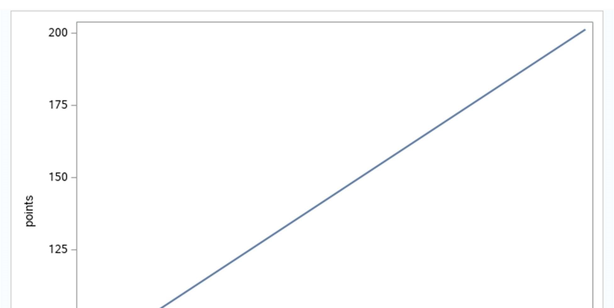

An ANOVA test was performed with a test for Homogeneity of Variance (Levene)
included on the variable country:

```SAS
   proc glm data=winedata.train plots=diagnostics;
   class country;
   model points=country;
   means country / hovtest=levene;
   run;
   quit;
```

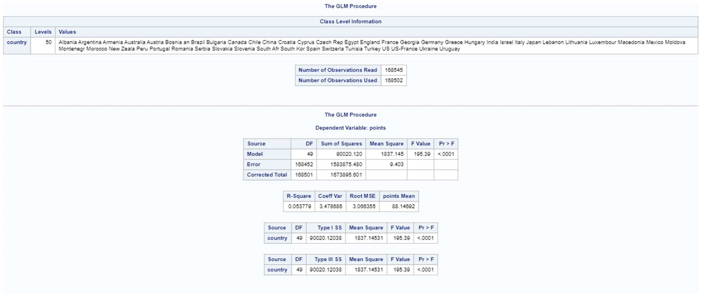

The test for HoV produced a p-value of \< .0001, therefore this ANOVA test cannot be trusted.

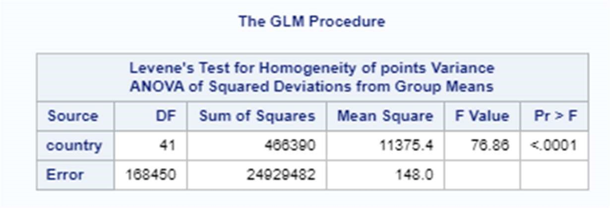

A Kruskal Wallis test was done in place of ANOVA due to Heterogeneity of Variance:

```SAS
   proc npar1way data=winedata.train;
   class country;
   var points;
   run;
```

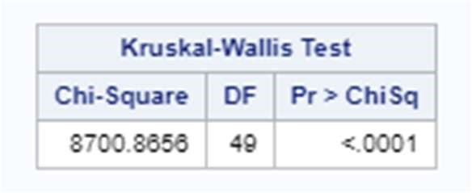

This test result of Pr \> ChiSq equal to \<.0001 indicates that country is a
significant independent variable.

A Post Hoc test was run on the variable country using Tukey’s adjustment:

```SAS
   proc glm data=winedata.train;
   class country;
   model points = country;
   lsmeans country / pdiff=all adjust=tukey;
   run; quit;
```

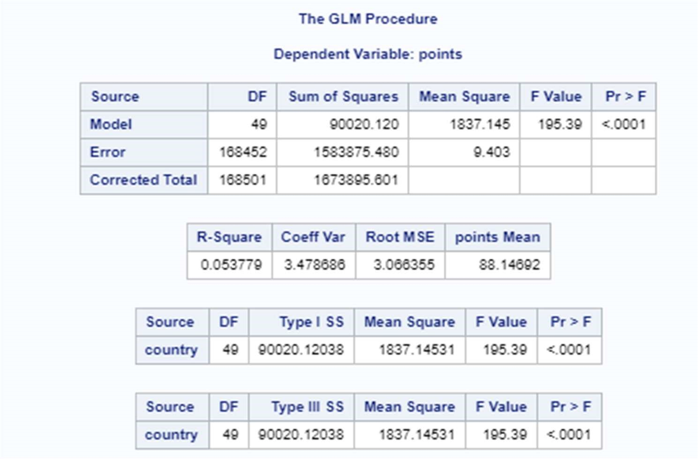

This test also showed significance with a Pr \> F equal to \<.0001

An ANOVA test was performed with a test for Homogeneity of Variance (Levene)
included on the variable variety:

```SAS
   proc glm data=winedata.train plots=diagnostics;
   class variety;
   model points=variety;
   means variety / hovtest=levene;
   run; quit;
```

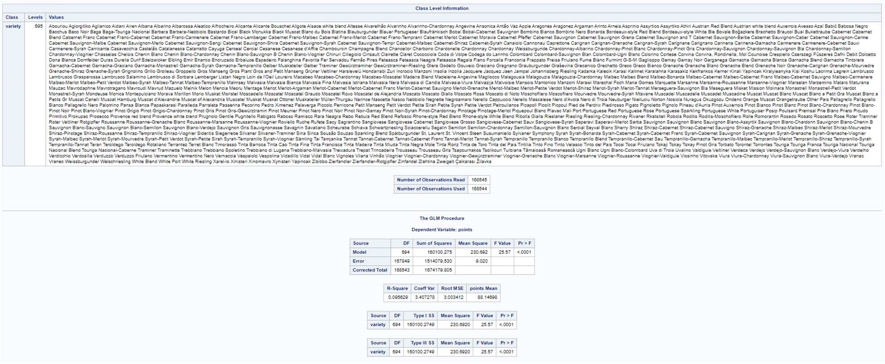

The test for HoV produced a p-value of \< .0001, therefore this ANOVA test cannot be trusted.

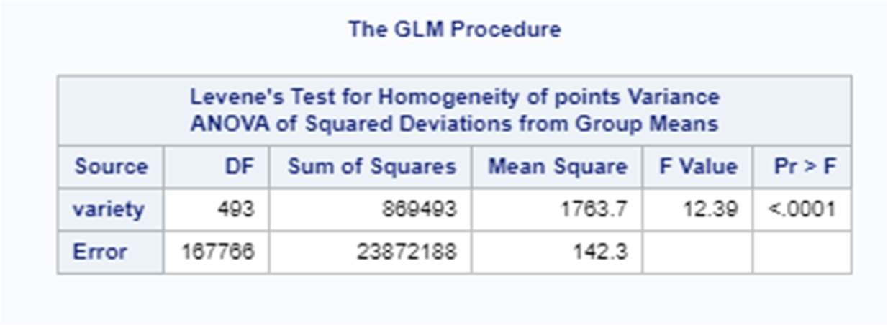

A Kruskal Wallis test was done in place of ANOVA due to Heterogeneity of Variance:

```SAS
   proc npar1way data=winedata.train;
   class variety;
   var points;
   run;
```

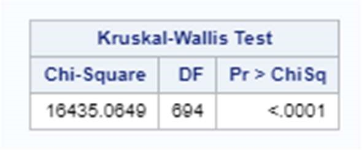

This test result of Pr \> ChiSq equal to \<.0001 indicates that variety is a
significant independent variable.

A Post Hoc test was run on the variable variety using Tukey’s adjustment, but it
timed out and was unable to be used for analysis.

The proc corr procedure was used on the variable price to find the Pearson correlation:

```SAS
   proc corr data=winedata.train;
   var price;
   with points;
   run;
```

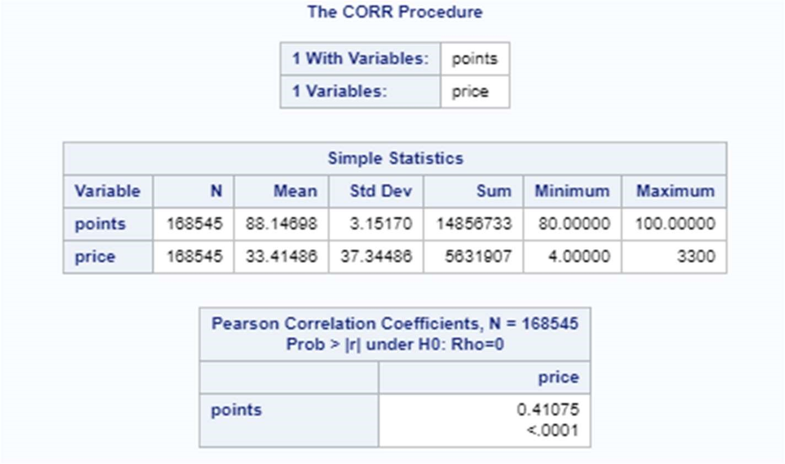

The results indicate that price has a correlation with points, though not a
particularly strong one at .41. The p-value indicates that Rho is likely not 0.

Multiple linear regression was used to create the model with the following hypotheses:

> H<sub>0</sub> The variables price, country, and variety do not predict the variable points
better than a baseline model.

> H<sub>A</sub> The variables price, country, and variety predict the variable points better
than a baseline model.

The following code was used to create the multiple linear regression model:

```SAS
   proc glm data=winedata.train;
   class country variety;
   model points= country price variety;
   store winedata.score;
   run; quit;
```

The model is stored in score so that it may later be applied to the validation dataset.

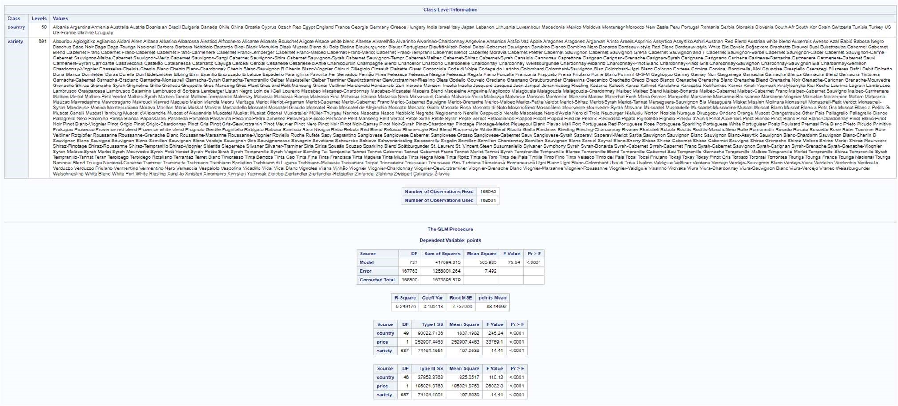

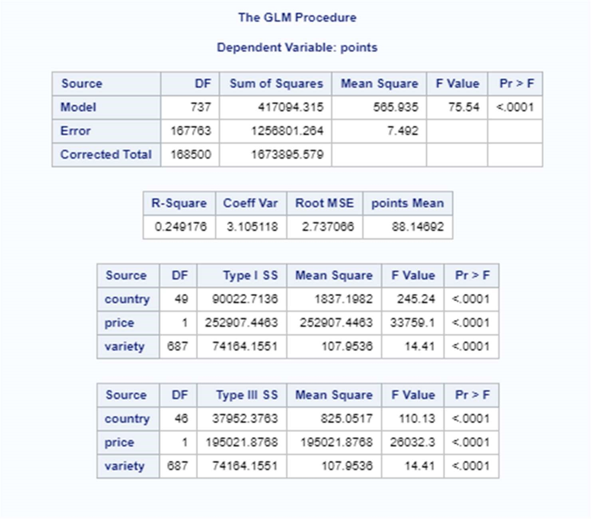

The results indicate that the model accounts for approximately 25% of the
variability in the response variable, as evidenced by the R-Square value of
0.29176. This is not a great score; the model is relatively weak. The p-values
(all \< .0001) indicate that each independent variable is a strong predictor
while controlling for the other variables. The HA hypothesis has been satisfied;
this model predicts better than a baseline model. 

The validation dataset was scored using the following code:

```SAS
   proc plm restore=winedata.score;
   score data=winedata.validate out=validated;
   code file="/folders/myfolders/wine-data/scoring.sas";
   run;
   
   data scored;
   set winedata.validate;
   %include "/folders/myfolders/wine-data/scoring.sas";
   run;
```

A new dataset was created, scored. This dataset contains a value P_points which
is the estimated value for points from the model.

The datasets were then compared using the following code:

```SAS
   proc compare base=validated compare=scored criterion=0.001;
   var points;
   with P_points;
   run;
```

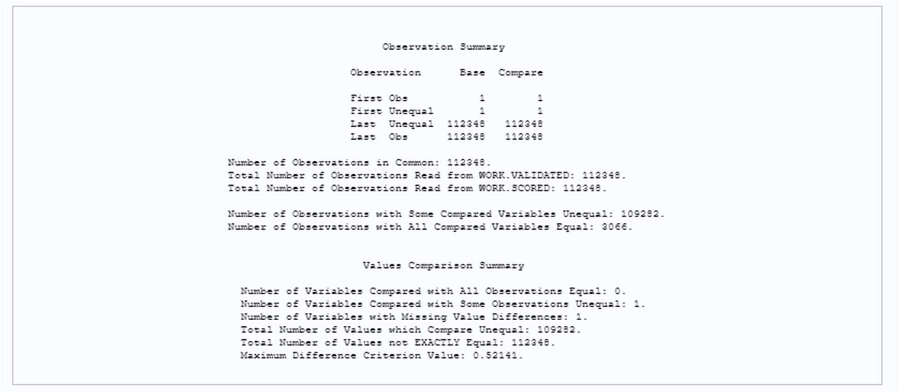

As can be seen in the above data, the “Total Number of Values not EXACTLY Equal”
is equal to 112,348 with a “Maximum Difference Criterion Value” of 0.52141. The
model did a poor job predicting the points values.

Data Summary and Implications 
==============================

The data indicates that there is no inherent bias toward certain wines with
regard to price, country or variety. The model accounted for only 25% of the
variability in the dependent variable, points. The model also performed poorly
when comparing the predicted points to actual points. The model largely
overestimated the points variable.

Predicting a wine’s review score using these variables is not advised.

A possible future study could be done using the variable description and text
mining to determine if certain words appear more frequently in higher or lower
reviews.

Another possible study would be to convert points to a categorical variable,
below 85, 8590, 91-95, and above 95. A decision tree could then be created using
price, country, variety and description.

This study could be replicated with another dataset, possibly from a different
timeframe or another source of reviews to confirm the lack of bias.

References 
===========

Flowers J. (2015). 10 Wine Magazines You Should Subscribe To. Retrieved from
https://learn.winecoolerdirect.com/wine-magazines/

Hosu, A., Floare-Avram, V., Magdas, D. A., Feher, I., Inceu, M., & Cimpoiu, C.
(2016). The Influence of the Variety, Vineyard, and Vintage on the Romanian White Wines Quality.

Journal of analytical methods in chemistry, 2016, 4172187.
doi:10.1155/2016/4172187

Kelley, K., & Ollendyke D. (2015). Build stronger relationships with your winery
and tasting room customers through reading and responding to online reviews.
Retrieved from
https://psuwineandgrapes.wordpress.com/2015/11/20/build-stronger-relationships-withyour-winery-and-tasting-room-customers-through-reading-and-responding-to-onlinereviews/

Li, & Hitt. (2010). Price Effects in Online Product Reviews: An Analytical Model
and Empirical Analysis. MIS Quarterly, 34(4), 809. doi: 10.2307/25750706

SAS (2019). Discover SAS.
https://www.sas.com/en_us/company-information/discover.html

Thoutt Z. (2017). Wine Deep Learing. Retrieved from
https://github.com/zackthoutt/winedeep-learning

Thoutt Z. (2017). Wine Reviews at Kaggle. Retrieved from
https://www.kaggle.com/zynicide/wine-reviews

Tuffery S. (2011). Data mining and statistics for decision making. Chichester,
West Sussex: Wiley.

Wikipedia. (2019). Oenology. Retrieved from
https://en.wikipedia.org/wiki/Oenology

Wine Enthusiast. (2019). Wine Enthusiast. Retrieved from
https://www.winemag.com/


